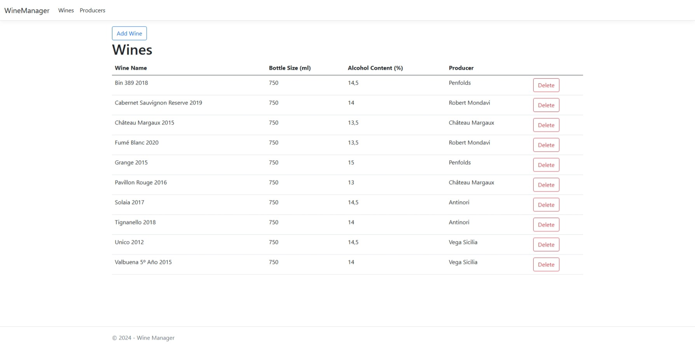

# WineManager
> A web application for managing wines and wine producers. Built with a three-tier architecture, featuring a database, a web API, and a user-friendly web interface.

## Table of Contents
* [General Information](#general-information)
* [Technologies Used](#technologies-used)
* [Features](#features)
* [Screenshots](#screenshots)
* [Contact](#contact)

## General Information
- Manage wines and their producers through a simple web interface.
- Built with a three-tier architecture: Database, Web API, and UI.
- Supports CRUD operations (Create, Read, Update, Delete) for wines and producers.

## Technologies Used
- Programming Language: C#
- Backend Framework: .NET
- Frontend: HTML, JavaScript, CSS
- Database: SQLite

## Features
- Add, edit, and delete wines and wine producers.
- View a list of all wines and their producers.
- Integrated search to find wines or producers quickly.
- RESTful Web API for database interaction.

## Screenshots

## Contact
Emelie Wärmlund - @emeliewarmlund@gmail.com  
   
[![LinkedIn][linkedin-shield]][linkedin-url]

<!-- MARKDOWN LINKS & IMAGES -->
<!-- https://www.markdownguide.org/basic-syntax/#reference-style-links -->
[linkedin-shield]: https://img.shields.io/badge/-LinkedIn-black.svg?style=for-the-badge&logo=linkedin&colorB=555
[linkedin-url]: https://linkedin.com/in/emelie-wärmlund-4b33bb98
